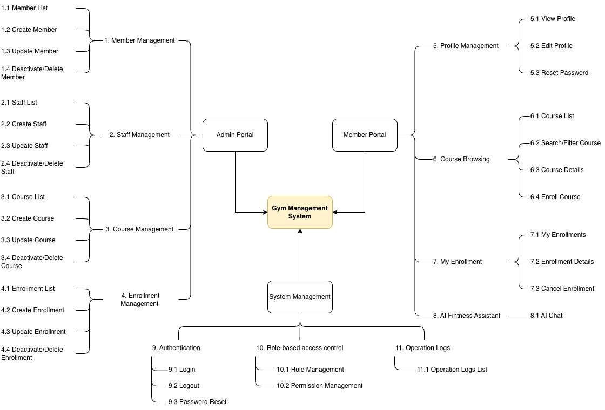

## 1. Revision History

| Version | Date       | Author      | Changes |
| ------- | ---------- | ----------- | ------- |
| v0.1    | 2026-06-15 | Yuchen Peng | Created the initial PRD document. |
| v0.2    | 2026-06-17 | Yuchen Peng | Added global notes and project background. |
| v0.3    | 2026-06-17 | Yuchen Peng | Added project scope and function structure diagram. |
| v0.4    | 2026-06-17 | Yuchen Peng | Added business process section. |


## 2. Global Notes

### 2.1 Glossary

| Term | Description |
| ---- | ----------- |
| Admin | A system user who manages members, staff, equipment, courses, and enrollments. |
| Member | A gym customer who can manage personal information, enroll in courses, and use the AI chat feature. |
| Course | A gym class or training session that members can enroll in. |
| Enrollment | A record created when a member enrolls in a course. |
| Equipment | Gym facilities or training devices managed by the admin. |
| AI Chat | A built-in assistant that provides general training and diet suggestions to members. |

### 2.2 Global Error Handling

| Scenario | System Behavior |
| -------- | --------------- |
| Network error | Show a clear error message and allow the user to retry. |
| Server error | Show a general error message and ask the user to try again later. |
| Unauthorized access | Redirect the user to the login page. |
| Permission denied | Show a message explaining that the current user does not have permission. |
| Form validation error | Highlight the invalid fields and show the reason. |

### 2.3 Default List Rules

| Rule | Description |
| ---- | ----------- |
| Default sorting | Lists are sorted by creation time in descending order by default. |
| Default page size | Each page shows 10 records by default. |
| Pagination | Pagination is shown when the total number of records is greater than 10. |
| Empty state | If no data is available, show `No data available`. |
| Missing value | If a field has no value, show `-`. |

### 2.4 Global Conventions

- Date format: `YYYY-MM-DD`.
- Time format: `HH:mm`.
- Currency format: `AUD`.
- All user-facing error messages should be clear, short, and non-technical.


## 3. Project Background

### 3.1 Current Situation

Small and medium-sized gyms often rely on manual records, spreadsheets, or disconnected tools to manage members, staff, equipment, courses, and enrollments. This may cause low efficiency, inconsistent data, and delayed enrollment updates.

For members, the experience can also be fragmented, as they often need to contact staff to update profiles, check courses, or ask for training and diet suggestions.

The main value indicators affected by these issues include:

| Stakeholder | Value Indicators |
| ----------- | ---------------- |
| Admin | Management efficiency, data accuracy, course enrollment handling time, equipment maintenance visibility |
| Member | Course enrollment convenience, profile management efficiency, access to training and diet guidance |
| Business Owner | Operational cost, member retention, course utilization, service quality |

### 3.2 Proposed Solution

This project aims to build a full-stack gym management system with a separated frontend and backend architecture.

The frontend handles user interfaces and interactions. The backend provides REST APIs, authentication, business logic, and data persistence.

The system will support two main user roles:

| Role | Main Capabilities |
| ---- | ----------------- |
| Admin | Manage members, staff, equipment, courses, and enrollments. |
| Member | View and update personal information, enroll in courses, and use AI chat for general training and diet suggestions. |

### 3.3 Goals

The project is expected to improve the following value indicators:

| Goal | Target Value |
| ---- | ------------ |
| Improve admin management efficiency | Reduce manual management effort by centralizing core gym operations in one system. |
| Improve data accuracy | Use structured database records instead of scattered manual records. |
| Improve member self-service experience | Allow members to update profiles and enroll in courses without staff assistance. |
| Improve course operation visibility | Allow admins to view course and enrollment information in a clear and structured way. |
| Provide basic intelligent assistance | Offer AI-based general training and diet suggestions to improve member engagement. |


## 4. Project Scope

### 4.1 Scope Overview

The system covers core gym workflows: admin management, member self-service, course enrollment, AI fitness assistance, authentication, role-based access control, and operation logs.

Payment, refund, coupon, payroll, and advanced financial features are excluded from this version.

### 4.2 Function Structure



### 4.3 In Scope

| Module | Included Features |
| ------ | ----------------- |
| Admin Portal | Member, staff, equipment, course, enrollment, and dashboard management. |
| Member Portal | Profile management, course browsing, course enrollment records, and AI fitness assistant. |
| System Management | Login, logout, password reset, role-based access control, and operation logs. |

### 4.4 Out of Scope

This version does not include:

- Online payment and payment records.
- Refund management.
- Coupon or promotion management.
- Payroll management.
- Advanced financial reports.
- Mobile app development.
- Real-time chat between members and trainers.
- Complex AI-generated long-term fitness plans.


## 5. Business Process

### 5.1 Admin Management Process

```text
Admin logs in
→ Selects a management module
→ Views the data list
→ Creates, updates, deactivates, or deletes records
→ System validates the input
→ System saves the changes
→ Operation log is recorded
```

This process applies to member, staff, equipment, course, and enrollment management.

### 5.2 Member Course Enrollment Process

```text
Member logs in
→ Browses course list
→ Views course details
→ Submits enrollment request
→ System checks course availability
→ Enrollment is created
→ Member views the enrollment in My Enrollments
```

If the course is full or unavailable, the system shows an error message and the enrollment is not created.

### 5.3 Enrollment Cancellation Process

```text
Member or admin opens enrollment details
→ Selects Cancel Enrollment
→ System checks whether cancellation is allowed
→ Enrollment status is updated to Cancelled
→ Operation log is recorded
```

### 5.4 AI Fitness Assistant Process

```text
Member opens AI Fitness Assistant
→ Enters a training or diet question
→ System sends the request to the AI service
→ AI returns a general suggestion
→ System displays the response
→ Chat history is saved
```

