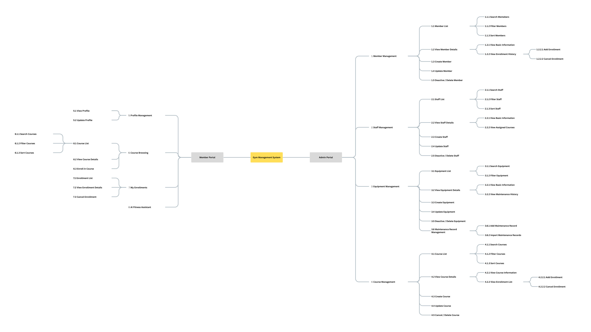

| Version | Date       | Author      | Changes                           |
| ------- | ---------- | ----------- | --------------------------------- |
| v0.1    | 2026-06-17 | Yuchen Peng | Created the initial PRD document. |

## Table of Contents

1. [Project Background](#1-project-background)
2. [Product Structure](#2-product-structure)
3. [Global Notes](#3-global-notes)
4. [Functional Requirements](#4-functional-requirements)
5. [Non-functional Requirements](#5-non-functional-requirements)

## 1. Project Background

### 1.1 Current Situation

Small and medium-sized gyms often rely on manual records, spreadsheets, or separate tools to manage members, staff, equipment, courses, and enrollments. This can lead to inefficient daily operations, inconsistent data, delayed updates, and limited visibility into core business activities.

From a value perspective, these problems reduce management efficiency for admins, create inconvenience for members, and make it harder for gym operators to maintain service quality and improve member retention.

### 1.2 Proposed Solution

The proposed solution is to build a full-stack Gym Management System with a separated frontend and backend architecture. The system will centralize core operations, including member, staff, equipment, course, and enrollment management.

Admins can manage business data through an admin portal, while members can update profiles, browse courses, enroll in courses, and use an AI fitness assistant for general training and diet suggestions.

### 1.3 Goals

| Goal | Target Value |
| ---- | ------------ |
| Improve admin management efficiency | Reduce manual work by centralizing member, staff, equipment, course, and enrollment management in one system. |
| Improve data accuracy | Replace scattered records with structured and consistent database records. |
| Improve member self-service experience | Allow members to update profiles, browse courses, and enroll in courses without staff assistance. |
| Improve course enrollment efficiency | Make course enrollment status easier to track and update in real time. |
| Improve member engagement | Provide AI-based training and diet suggestions to support member fitness goals. |

## 2. Product Structure

## 3. Global Notes

### 3.1 Glossary

| Term | Description |
| ---- | ----------- |
| Admin | A system user who manages gym operations through the Admin Portal. |
| Member | A gym customer who uses the Member Portal to manage profile information, browse courses, enroll in courses, and use the AI fitness assistant. |
| Staff | A gym employee or instructor who can be assigned to courses. |
| Equipment | A gym asset that can be created, updated, deactivated, deleted, and maintained. |
| Course | A gym class or training session available for member enrollment. |
| Enrollment | A record that links a member to a course. It can be created or cancelled from member details or course details. |
| Maintenance Record | A record of equipment maintenance history, either added manually or imported from a file. |
| AI Fitness Assistant | A member-facing chat feature that provides general training and diet suggestions. |

### 3.2 User Roles and Permissions

| Role | Main Permissions |
| ---- | ---------------- |
| Admin | Manage members, staff, equipment, maintenance records, courses, and enrollments. |
| Member | View and update profile, browse courses, enroll in courses, cancel own enrollments, and use the AI fitness assistant. |

### 3.3 Status Rules

| Object | Status Rules |
| ------ | ------------ |
| Member | Active members can use the system. Deactivated members cannot log in, but their history is kept. Deleted members are removed only when required by admin operation. |
| Staff | Active staff can be assigned to courses. Deactivated staff are kept for historical records. |
| Equipment | Equipment can be Available, Under Maintenance, or Retired. Under Maintenance and Retired equipment should not be treated as available. |
| Course | Courses can be Open, Full, Cancelled, or Completed. Members can only enroll in Open courses. |
| Enrollment | Enrollments can be Active or Cancelled. Cancelled enrollments remain in history. |

### 3.4 Default List Rules

| Rule | Description |
| ---- | ----------- |
| Pagination | Lists use pagination by default. |
| Search | Search should support key fields such as name, email, phone, course name, or equipment name where applicable. |
| Filter | Filters should support common status, category, date, and role-related fields where applicable. |
| Sorting | Lists are sorted by creation time in descending order by default unless otherwise specified. |
| Empty state | If no records are found, show `No data available`. |
| Missing value | If a field has no value, show `-`. |

### 3.5 Unified Exception Handling

| Scenario | Handling Rule |
| -------- | ------------- |
| Validation error | Show a clear field-level error message and prevent submission. |
| Unauthorized access | Redirect the user to the login page or show an access denied message. |
| Data not found | Show a friendly not found message. |
| Duplicate record | Show a clear message and prevent duplicate creation. |
| File import error | Show invalid rows and reasons before importing maintenance records. |
| System error | Show a general error message and ask the user to try again later. |

## 4. Functional Requirements

### 4.1 Admin Portal

#### 4.1.1 Member Management

| Function | Description |
| -------- | ----------- |
| Member List | Admin can view the member list and search, filter, or sort members. |
| View Member Details | Admin can view member basic information and enrollment history. |
| Create Member | Admin can create a new member account. |
| Update Member | Admin can update member information. |
| Deactivate / Delete Member | Admin can deactivate or delete a member based on business needs. |
| Add / Cancel Enrollment | Admin can add or cancel a member's enrollment from the member details page. |

#### 4.1.2 Staff Management

| Function | Description |
| -------- | ----------- |
| Staff List | Admin can view the staff list and search, filter, or sort staff. |
| View Staff Details | Admin can view staff basic information and assigned courses. |
| Create Staff | Admin can create a new staff record. |
| Update Staff | Admin can update staff information. |
| Deactivate / Delete Staff | Admin can deactivate or delete a staff record. |

#### 4.1.3 Equipment Management

| Function | Description |
| -------- | ----------- |
| Equipment List | Admin can view the equipment list and search or filter equipment. |
| View Equipment Details | Admin can view equipment basic information and maintenance history. |
| Create Equipment | Admin can create a new equipment record. |
| Update Equipment | Admin can update equipment information. |
| Deactivate / Delete Equipment | Admin can deactivate or delete an equipment record. |
| Add Maintenance Record | Admin can manually add a maintenance record for equipment. |
| Import Maintenance Records | Admin can import maintenance records from a file. |

#### 4.1.4 Course Management

| Function | Description |
| -------- | ----------- |
| Course List | Admin can view the course list and search, filter, or sort courses. |
| View Course Details | Admin can view course information and the enrollment list. |
| Create Course | Admin can create a new course. |
| Update Course | Admin can update course information. |
| Cancel / Delete Course | Admin can cancel or delete a course based on business needs. |
| Add / Cancel Enrollment | Admin can add or cancel enrollments from the course details page. |

### 4.2 Member Portal

#### 4.2.1 Profile Management

| Function | Description |
| -------- | ----------- |
| View Profile | Member can view personal profile information. |
| Update Profile | Member can update allowed personal information. |

#### 4.2.2 Course Browsing

| Function | Description |
| -------- | ----------- |
| Course List | Member can browse available courses and search, filter, or sort courses. |
| View Course Details | Member can view course details, including time, instructor, capacity, and status. |
| Enroll in Course | Member can enroll in an open course if seats are available. |

#### 4.2.3 My Enrollments

| Function | Description |
| -------- | ----------- |
| Enrollment List | Member can view their own enrollment records. |
| View Enrollment Details | Member can view details of a selected enrollment. |
| Cancel Enrollment | Member can cancel an active enrollment when cancellation is allowed. |

#### 4.2.4 AI Fitness Assistant

| Function | Description |
| -------- | ----------- |
| AI Chat | Member can ask general training and diet questions through the AI fitness assistant. |

### 4.3 Common Functional Rules

| Rule | Description |
| ---- | ----------- |
| Authentication | Users must log in before accessing protected pages. |
| Authorization | Admin and member users can only access features allowed by their role. |
| Data Validation | Required fields, valid formats, and business rules must be checked before submission. |
| Operation Feedback | The system should show success, error, and confirmation messages where needed. |
| Confirmation | Destructive actions such as delete, deactivate, cancel, or import must require confirmation. |

## 5. Non-functional Requirements

### 5.1 Performance Requirements

| Requirement | Description |
| ----------- | ----------- |
| Page Response | Main pages should load within an acceptable time under normal usage. |
| API Response | Common API requests should return results quickly under normal data volume. |
| Pagination | Large lists must use pagination to avoid loading all records at once. |

### 5.2 Security Requirements

| Requirement | Description |
| ----------- | ----------- |
| Authentication | The system must protect private pages from unauthenticated access. |
| Authorization | Role-based access control must prevent members from accessing admin features. |
| Password Security | Passwords must be stored securely and never saved as plain text. |
| Input Protection | User input and imported files must be validated to reduce invalid or unsafe data. |

### 5.3 Data Requirements

| Requirement | Description |
| ----------- | ----------- |
| Data Consistency | Related records such as members, courses, enrollments, equipment, and maintenance records must remain consistent. |
| Historical Records | Important history such as enrollments and maintenance records should be kept unless deletion is required. |
| Audit Fields | Core records should include created time and updated time. |

### 5.4 Usability Requirements

| Requirement | Description |
| ----------- | ----------- |
| Clear Navigation | Admin Portal and Member Portal should have clear module navigation. |
| Clear Feedback | The system should provide clear messages for successful operations, errors, and empty states. |
| Responsive Layout | The system should be usable on common desktop screen sizes. |

### 5.5 Maintainability Requirements

| Requirement | Description |
| ----------- | ----------- |
| Separated Architecture | Frontend and backend should be separated, with the backend providing REST APIs. |
| Modular Design | Features should be organized by modules such as member, staff, equipment, course, and enrollment. |
| Error Logging | Backend errors should be logged for debugging and maintenance. |
