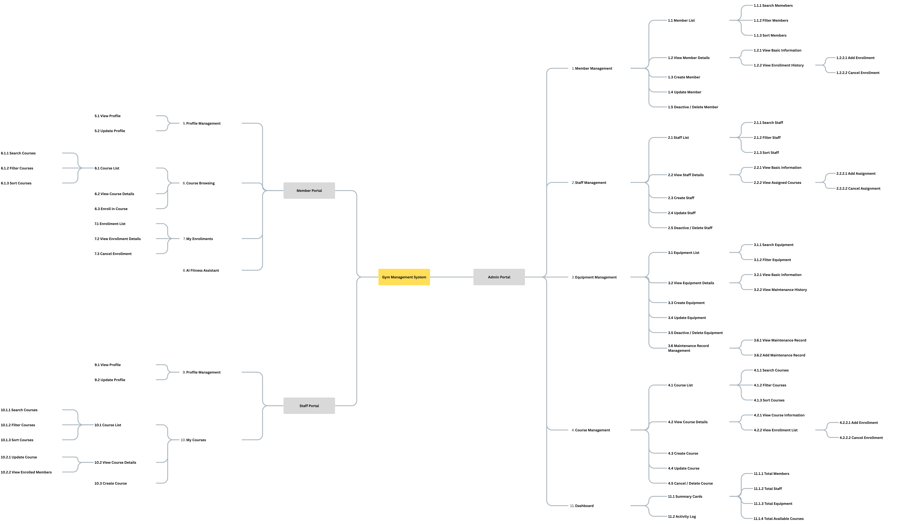

| Version | Date       | Author      | Changes                           |
| ------- | ---------- | ----------- | --------------------------------- |
| v0.1    | 2026-06-17 | Yuchen Peng | Created the initial PRD document. |
| v0.2    | 2026-06-29 | Yuchen Peng | Added Staff Portal and updated role-based features. |

## Table of Contents

1. [Project Background](#1-project-background)
2. [Product Structure](#2-product-structure)
3. [Global Notes](#3-global-notes)
4. [Functional Requirements](#4-functional-requirements)
5. [Non-functional Requirements](#5-non-functional-requirements)

## 1. Project Background

### 1.1 Current Situation

Small and medium-sized gyms often use manual records, spreadsheets, or separate tools to manage members, staff, equipment, courses, and course enrollments. This can cause inefficient operations, inconsistent data, and limited visibility into daily gym activities.

### 1.2 Proposed Solution

This project will build a full-stack Gym Management System using a separated frontend and backend architecture.

The system provides three portals based on user roles:

- Admin Portal: manage gym operations and view key business data.
- Staff Portal: manage assigned courses and view course members.
- Member Portal: manage personal profile, enroll in courses, and use the AI fitness assistant.

### 1.3 Goals

| Goal | Description |
| ---- | ----------- |
| Improve operation efficiency | Centralize member, staff, equipment, course, and enrollment management. |
| Improve data consistency | Store core business data in a structured database. |
| Improve role-based workflow | Provide different features for admins, staff, and members. |
| Improve member experience | Allow members to browse courses, enroll online, and use AI fitness suggestions. |
| Support portfolio value | Demonstrate full-stack development, database design, REST API design, authentication, authorization, and enterprise-style documentation. |

## 2. Product Structure

## 3. Global Notes

### 3.1 Glossary

| Term | Description |
| ---- | ----------- |
| Admin | A system user who manages gym operations. |
| Staff | A gym employee or instructor who manages assigned courses. |
| Member | A gym customer who can manage personal information, enroll in courses, and use the AI fitness assistant. |
| Equipment | A gym asset that can be managed and maintained. |
| Course | A gym class or training session available for member enrollment. |
| Enrollment | A record that links a member to a course. |
| Teaching Assignment | A record that links a staff member to a course as an instructor. |
| Maintenance Record | A record of equipment maintenance history. |
| Activity Log | A system record of important actions, such as course creation, course enrollment, and staff assignment. |
| AI Fitness Assistant | A member-facing chat feature that provides general training and diet suggestions. |

### 3.2 User Roles and Permissions

| Role | Main Permissions |
| ---- | ---------------- |
| Admin | Manage members, staff, equipment, courses, enrollments, teaching assignments, dashboard data, and activity logs. |
| Staff | Create and update own courses, view assigned courses, and view enrolled members of own courses. |
| Member | View and update own profile, browse courses, enroll in courses, cancel own enrollments, and use the AI fitness assistant. |

### 3.3 Status Rules

| Object | Status Rules |
| ------ | ------------ |
| Member | Active members can use the system. Deactivated members cannot log in, but historical records are kept. |
| Staff | Active staff can be assigned to courses. Deactivated staff are kept for history. |
| Equipment | Equipment can be Available, Under Maintenance, or Retired. |
| Course | Courses can be Open, Full, Cancelled, or Completed. Members can only enroll in Open courses. |
| Enrollment | Enrollments can be Active or Cancelled. Cancelled records remain in history. |

### 3.4 Default List Rules

| Rule | Description |
| ---- | ----------- |
| Pagination | Lists use pagination by default. |
| Search | Search supports key fields such as name, email, phone, course name, or equipment name. |
| Filter | Filters support common fields such as status, role, category, and date. |
| Sorting | Lists are sorted by creation time in descending order by default. |
| Empty state | If no records are found, show `No data available`. |
| Missing value | If a field has no value, show `-`. |

### 3.5 Unified Exception Handling

| Scenario | Handling Rule |
| -------- | ------------- |
| Validation error | Show clear field-level error messages and prevent submission. |
| Unauthorized access | Redirect to login or show an access denied message. |
| Data not found | Show a friendly not found message. |
| Duplicate record | Show a clear duplicate data message and prevent creation. |
| System error | Show a general error message and ask the user to try again later. |

## 4. Functional Requirements

### 4.1 Admin Portal

#### 4.1.1 Dashboard

| Function | Description |
| -------- | ----------- |
| View Summary Cards | Admin can view total members, total staff, total equipment, and total available courses. |
| View Activity Log | Admin can view important system activities, such as course creation, member enrollment, and staff assignment. |

#### 4.1.2 Member Management

| Function | Description |
| -------- | ----------- |
| Member List | Admin can view, search, filter, and sort members. |
| View Member Details | Admin can view member profile and enrollment history. |
| Create Member | Admin can create a new member account. |
| Update Member | Admin can update member information. |
| Deactivate / Delete Member | Admin can deactivate or delete a member based on business needs. |
| Manage Enrollment | Admin can add or cancel a member's course enrollment. |

#### 4.1.3 Staff Management

| Function | Description |
| -------- | ----------- |
| Staff List | Admin can view, search, filter, and sort staff. |
| View Staff Details | Admin can view staff information and assigned courses. |
| Create Staff | Admin can create a new staff account. |
| Update Staff | Admin can update staff information. |
| Deactivate / Delete Staff | Admin can deactivate or delete a staff member based on business needs. |
| Manage Teaching Assignment | Admin can assign staff to courses or update course teaching records. |

#### 4.1.4 Equipment Management

| Function | Description |
| -------- | ----------- |
| Equipment List | Admin can view, search, filter, and sort equipment. |
| View Equipment Details | Admin can view equipment information and maintenance history. |
| Create Equipment | Admin can create a new equipment record. |
| Update Equipment | Admin can update equipment information and status. |
| Deactivate / Delete Equipment | Admin can deactivate or delete equipment based on business needs. |
| Add Maintenance Record | Admin can add maintenance records for equipment. |

#### 4.1.5 Course Management

| Function | Description |
| -------- | ----------- |
| Course List | Admin can view, search, filter, and sort courses. |
| View Course Details | Admin can view course information, enrolled members, and assigned staff. |
| Create Course | Admin can create a new course. |
| Update Course | Admin can update course information. |
| Cancel / Delete Course | Admin can cancel or delete a course based on business needs. |
| Manage Course Enrollment | Admin can add or cancel course enrollments. |
| Manage Teaching Record | Admin can assign or update course instructors. |

### 4.2 Staff Portal

#### 4.2.1 My Courses

| Function | Description |
| -------- | ----------- |
| Course List | Staff can view courses assigned to them. |
| View Course Details | Staff can view course details and enrolled members. |
| Create Course | Staff can create a course for admin review or direct publishing based on system rules. |
| Update Course | Staff can update courses they created or are assigned to. |
| Delete Restriction | Staff cannot delete courses. Only admins can delete courses. |

### 4.3 Member Portal

#### 4.3.1 Profile Management

| Function | Description |
| -------- | ----------- |
| View Profile | Member can view personal profile information. |
| Update Profile | Member can update allowed personal information. |
| Deactivate Account | Member can request or perform account deactivation based on system rules. |

#### 4.3.2 Course Browsing and Enrollment

| Function | Description |
| -------- | ----------- |
| Course List | Member can browse available courses and search, filter, or sort courses. |
| View Course Details | Member can view course details, including time, instructor, capacity, and status. |
| Enroll in Course | Member can enroll in an open course if seats are available. |
| Cancel Enrollment | Member can cancel an active enrollment when cancellation is allowed. |

#### 4.3.3 My Enrollments

| Function | Description |
| -------- | ----------- |
| Enrollment List | Member can view their own enrollment records. |
| View Enrollment Details | Member can view details of a selected enrollment. |

#### 4.3.4 AI Fitness Assistant

| Function | Description |
| -------- | ----------- |
| AI Chat | Member can ask general training and diet questions through the AI fitness assistant. |

### 4.4 Common Functional Rules

| Rule | Description |
| ---- | ----------- |
| Authentication | Users must log in before accessing protected pages. |
| Authorization | Users can only access features allowed by their role. |
| Data Validation | Required fields, valid formats, and business rules must be checked before submission. |
| Operation Feedback | The system should show success, error, and confirmation messages where needed. |
| Confirmation | Destructive actions such as delete, deactivate, cancel, or import must require confirmation. |

## 5. Non-functional Requirements

### 5.1 Performance Requirements

| Requirement | Description |
| ----------- | ----------- |
| Page Response | Main pages should load within an acceptable time under normal usage. |
| API Response | Common API requests should return results quickly under normal data volume. |
| Pagination | Large lists must use pagination to avoid loading all records at once. |

### 5.2 Security Requirements

| Requirement | Description |
| ----------- | ----------- |
| Authentication | The system must protect private pages from unauthenticated access. |
| Authorization | Role-based access control must prevent users from accessing unauthorized features. |
| Password Security | Passwords must be stored securely and never saved as plain text. |
| Input Validation | User input must be validated before being stored or processed. |

### 5.3 Data Requirements

| Requirement | Description |
| ----------- | ----------- |
| Data Consistency | Related records such as members, staff, courses, enrollments, equipment, and maintenance records must remain consistent. |
| Historical Records | Important history such as enrollments, teaching assignments, maintenance records, and activity logs should be kept. |
| Audit Fields | Core records should include created time and updated time. |

### 5.4 Usability Requirements

| Requirement | Description |
| ----------- | ----------- |
| Clear Navigation | Admin, Staff, and Member portals should have clear module navigation. |
| Clear Feedback | The system should provide clear messages for successful operations, errors, and empty states. |
| Responsive Layout | The system should be usable on common desktop screen sizes. |

### 5.5 Maintainability Requirements

| Requirement | Description |
| ----------- | ----------- |
| Separated Architecture | Frontend and backend should be separated, with the backend providing REST APIs. |
| Modular Design | Features should be organized by modules such as member, staff, equipment, course, enrollment, and AI assistant. |
| Error Logging | Backend errors should be logged for debugging and maintenance. |
