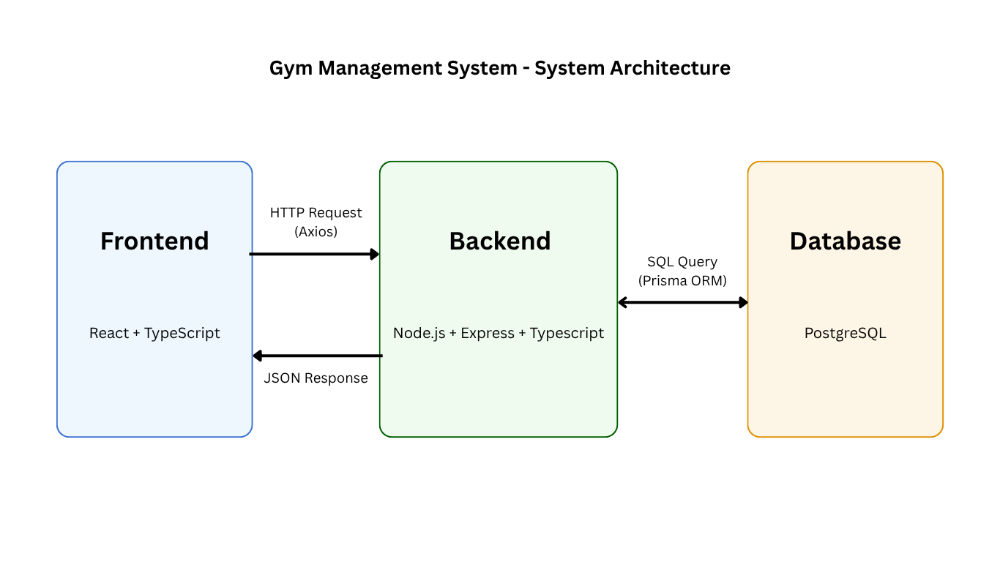

# 03. System Architecture

The system uses a frontend-backend separated architecture. The frontend is responsible for page rendering, user interaction, form submission, and data display. The frontend communicates with the backend through Axios by sending HTTP requests, and the backend returns data in JSON format. The backend provides REST APIs, handles business logic, authentication, authorization, and data validation. The backend also interacts with the PostgreSQL database through Prisma ORM to complete data persistence operations.